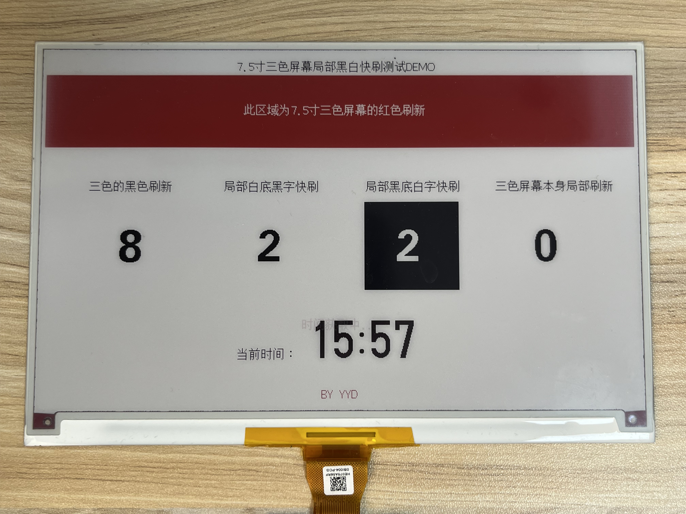

## 7.5寸三色墨水屏黑白局部快刷驱动


### 项目简介
此项目在三色墨水屏上增加了黑白两色的局部快刷，并且集成到<a target="_blank" href="https://github.com/ZinggJM/GxEPD2">GxEPD2</a>库中，原库中的函数可以正常使用，使用黑白局部快刷的时候调用新加函数即可 <br>
- **B站视频演示地址：[点击观看视频](https://www.bilibili.com/video/BV1Fo4y137n9/?vd_source=a935ffb91a0eac4e16a0461b0709faa9)**<br>
- <a target="_blank" href="https://qm.qq.com/cgi-bin/qm/qr?k=OCk2mwPC4yZn-BBJlH2ehWT-2sHfC7Os&jump_from=webapi&authKey=iFtohDmv6OI7O5aD/0ogd6mODvY5vr837fherj6ruuDCK94UM5KrjicZ2cFO5dHB"></a>QQ交流群：1051455459


### 使用的硬件
- 一个使用<a target="_blank" href="https://github.com/ZinggJM/GxEPD2">GxEPD2</a>库中GxEPD2_750c_Z08驱动的7.5寸三色墨水屏，驱动芯片为UC8179
- 一个ESP32C3墨水屏开发板（闲鱼搜用户<光芒之轻>有成品售卖）

### 示例DEMO文件夹
- 此文件夹中为示例代码，根据自己的驱动板修改相关io口以及无线网账号密码，编译上传墨水屏后即可查看效果。<br>

### 驱动文件夹
- 此文件夹中为集成过的驱动文件，使用时请备份原驱动后直接替换到库的目录中<br>

- 黑白局刷调用方式如下，注意程序中不能有红色，使用display.setPartialWindow函数，然后刷新的时候使用display.nextPageBW函数


``` C
    display.setPartialWindow(248, 204, 120, 120);
    display.fillScreen(GxEPD_WHITE);
    display.firstPage();     
    do {
       //执行你的刷新程序
        } while (display.nextPageBW());
``` 
- 驱动保留了原有的局刷函数，方便用全刷的方式更新墨水屏部分区域，适合全刷需要获取大量api的情况，只更新部分就行可以减少刷新时间<br>
 ``` C
    display.setPartialWindow(248, 204, 120, 120);
    display.fillScreen(GxEPD_WHITE);
    display.firstPage();     
    do {
       //执行你的刷新程序
        } while (display.nextPage());
``` 

### 注意事项
- 确保自己墨水屏驱动ic为UC8179 
- 在调用display.setFullWindow()的时候不要使用display.nextPageBW()更新

### 已知bug
-   


### 制作不易，感谢支持

